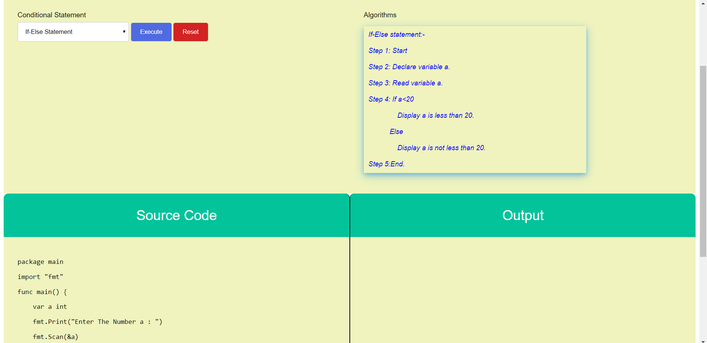
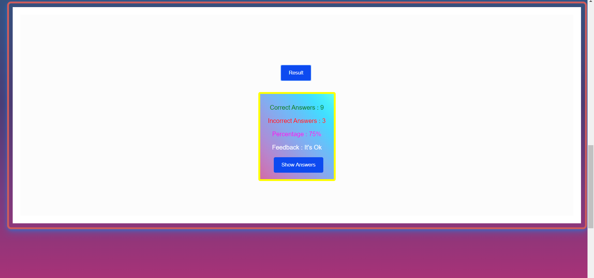

## Round 2

<b>Experiment :  Understanding & Analysing Conditional Statements in Go Programming Language.</b>

### 1. Story Outline:

 The experiment involves understanding Conditional Statements in Go Programming Language.The simulator takes input from student which gives the result of each step of program and let him understand each statement. 

### 2. Story:

#### 2.1 Set the Visual Stage Description:
<h2>Construction of the set-up</h2>

For better visualization, a simulator is provided. A simulation can always act as the best possible alternative to learn. the simulator is divided into three sections:  
➢	Operator Section: Helps in interacting with the  student (accepting  operator name from student). 
➢	Source Code Section: Displays the subsequent code for each type of choice the student takes to perform any operation. 
➢	Output Section: Displays the output that will be generated after the code runs successfully.

#### 2.2 Set Student Objectives & Goals:

Sr. No |	Learning Objective	| Cognitive Level | Action Verb
:--|:--|:--|:-:
1.| Student will be able to:  Describe Conditional Statements in Go Programming Language. | Understand | Describe
2.| Student will be able to:  Explain the algorithm for using Conditional Statements in Go programming language.  | Understand| Explain
3.| Student will be able to:  Analyse the algorithm for conditional statements. | Analyze | Analyse

</b>

#### 2.3 Set the Pathway Activities:

The Simulator tab would allow: 
<dd> 1. The setup consists of a simulator that helps in performing conditional statements with the use of Go Language 
    2. There will be three sections to work upon: Operator Section, Source Code Section and Output Section. 
    3. The source code section will display the Program for the type of conditional statement you want to perform. 
    4. The Output section shows the result of each instruction of the Algorithm. 
    5. Once the program is executed in simulator, student can move to program task by clicking 'Program Task' button of the simulator. 
    6. After Completion of given task, the result of the progress will be shown along with the feedback.
</dd>

##### 2.4 Set Challenges and Questions/Complexity/Variations in Questions:

Assessment Questions: 

 1. A switch statement is used to- 
a.	To compare two variables 
b.	Switch between function in a program 
c.	Switch from one variable to another 
d.  To choose from multiple possibilities which may arise due to different values of a single variable 

 2. Which one of the following statement is correct? 
a.	else if is necessary to use with if statement 
b.	else is necessary to use with if statement 
c.  else or else if is optional with if statement 
d.	None of the above 

 3. Conditional statements can be used within another conditional statements that are called - 
a.	Nesting Conditional statements 
b.	Compound statements 
c.	Switch Statements 
d.	None of the Above  
4. Can an else statement exist without an if statement preceding it? 
a.	Yes, else statement can exist without an if statement 
b.	No, an else statement can only exist with an if statement 
c.	Else cannot exist without an if statement, but an else-if statement can exist without a preceding if statement 
d.	Yes, an else statement can exist without an if statement if its the first line inside the main ()
  
5.  Is nested switch statements possible? 
a)	Yes 
b)	No 
c)	Can't say 
d)	None of the above 

##### 2.5  Allow Pitfalls:

<dd>
    1. Wrong Syntax in Assesment. 
</dd>

##### 2.6 Conclusion:
<dd>    The Go programming simulator helps the Student to understand and analyse the conditional statements in Go Programming.
</dd>

##### 2.7 Equations/formulas: NA

### 3. Flowchart

### 4. Mindmap

 
### 5. Storyboard 

The experiment of the Lab includes a simulator that provides an interface to the student for understanding the conditional statements in Go Programming Language. The simulator is divide into three sections named as operator section, source code section and output section. Simulator uses conditional statements to illustrate an algorithm in Go Programming. The student is asked to select one of the statements and click the execute button in the simulator which will show the algorithm steps.
 
 
<b>figure 1:</b>
  

 
 

The simulator then start iterating the code that is shown in the source code and output section of the simulator. The code in the source code section is generated for every conditional statement chosen by the student. After clicking the next instruction button the student sees the output of each step of the program along with an explanation. If student wishes to go back to a previous instruction then student can click on previous button.
  
  
 <b>figure 2:</b>
  

 
<b>figure 3:</b>
  

 
 

During the line by line execution of the program, the student is asked to enter the value of input and the result is shown in the output screen.
 
 
 <b>figure 4:</b>
  

 
 <b>figure 5:</b>
  

 
 

As the student completes the simulator he can reset and make another choice of conditional statement and run the simulator again. There is a Program Task in simulator which appears when student click 'Program Task' button of the simulator that appears only after program execution is completed in simulator.
 
 
<b>figure 6:</b>
  

 
 

The Program Task section takes the student to the questions based on Go Programming language where the student has to fill the missing gaps in the code. The missing gaps in the program test the student's understanding of usage of conditional statement. The student attempts the questions and after completing the questions, the student is allotted marks and a button appears to move back to simulator where if the student does not get satisfactory marks he can move back to the simulator to understand the concept once again.
 
 
<b>figure 7:</b>
  

 
 
 <b>figure 8:</b>
  

  
 <b>figure 9:</b>
  

  
 <b>figure 10:</b>
  

  

